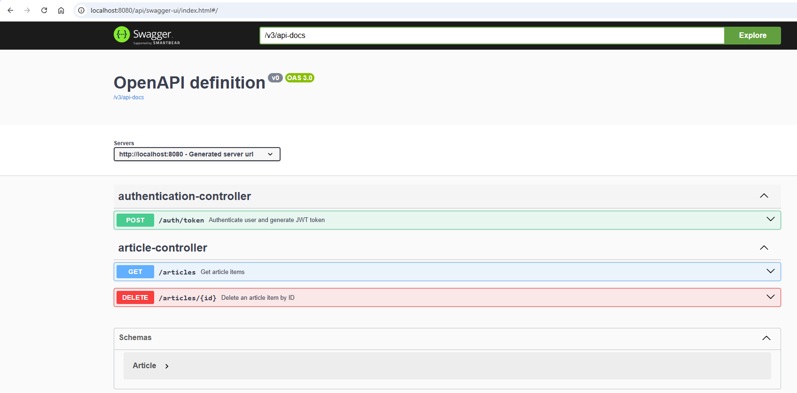

# Java Backend Technical Test

# 🚀 Overview

This Spring Boot application connect to Hacker News to retrieve data and persist it in a database every 1 hour. Also enable a REST API to perform operations with persisted data. Additionally, it is secured with JWT.

Some key points to consider:

- When the app starts it automatically retrieve the latest 100 article items and insert them into MongoDB.
- Every 1 hour the app retrieves the new latest 100 article items (insert new ones, ignore existing ones).
- Important variables are read as environment properties (not part of the code itself).

# ⚙️ Stack

- Java 17
- Spring Boot 3.3.8
- Maven
- MongoDB
- Docker Compose
- GitHub Actions
- JUnit and Mockito
- PMD

# 📦 Project Structure

```
auth
 - config
 - controller
 - security
article
 - config
 - controller
 - domain
 - exception
 - mapper
 - repository
 - service
```

# 🔑 JWT Authentication

Generate a JWT using basic auth. The app has only 1 valid user where the username and password are provided as environment variable to the app using `SECURITY_JWT_USERNAME` and
`SECURITY_JWT_PASSWORD`.

Request a new JWT token

```
 curl -X POST -u test:password1 http://localhost:8080/auth/token 
```

Then use that bearer token to access to the /articles endpoint. Example:

```
curl -X GET 'http://localhost:8080/articles' \
    --header 'Authorization: Bearer eyJhbGciOiJIU....'
```

# 📊 API Documentation

Swagger UI is available at: http://localhost:8080/api/docs



# 🐳 Docker Commands

Build and run services (springboot-app and mongo-db) using docker-compose

```
docker-compose up -d --build
```

The above command will compile the java app and also create and run the docker images.

Stop the services containers

```
docker-compose stop
```

# Demo app

[video demo](https://drive.google.com/file/d/1L0OZ2y5Ae_pBkgUloI_fcn4jn6PeDZw5/view?usp=sharing)

# ✨ Future Improvements
- Integrate a `UserDetailsService` with a database connection to manage application Users instead of loading only 1 user using environment variables.
- Retrieve all the article information at every scheduled execution. Without max items restrictions. Iterate using API parameters `hitsPerPage` and `page` until reach the latest known item previously stored in the database.
- Secure MongoDB connection using username and password.
- Add MongoDB indexes to improve query performance.